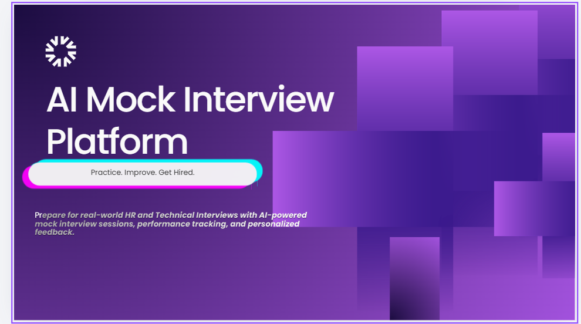
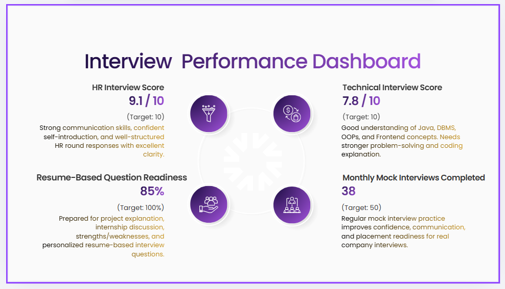

# AI-Mock-Interview-Platform
A React based platform for practicing mock interviews with AI-powered feedback, performance tracking, and interview analytics.


## Project Overview

AI Mock Interview Platform is a web-based application designed to help students prepare for technical and HR interviews through realistic mock interview sessions.

The platform provides interview questions, timer-based answering, performance tracking, and personalized feedback to improve confidence and interview readiness.

---

## Features

- User Login & Signup
- HR + Technical Interview Categories
- Timer-Based Interview Sessions
- Answer Submission System
- AI-Based Feedback & Score Analysis
- Performance Dashboard
- Interview History Tracking
- Resume-Based Question Suggestions
- Admin Panel for Question Management

---

## Tech Stack
## Project Preview

### Dashboard Preview



### Performance Preview




### Frontend
- React.js
- JavaScript
- Tailwind CSS

### Backend
- Node.js
- Express.js

### Database
- MongoDB

### APIs (Future Scope)
- OpenAI API
- Speech Recognition API
- Webcam Recording API

---

## Folder Structure

```text
AI-Mock-Interview-Platform/
│
├── frontend/
├── backend/
├── screenshots/
├── README.md
│
└── package.json
```

---

## Future Enhancements

- Voice Answer Recording
- Video Interview Simulation
- Resume Upload & Analysis
- AI Confidence Score
- Real-Time Feedback System
- Multi-language Support

---

## Author

Pragya Dwivedi  
B.Tech CSE Student  
Aspiring Software Developer

---
